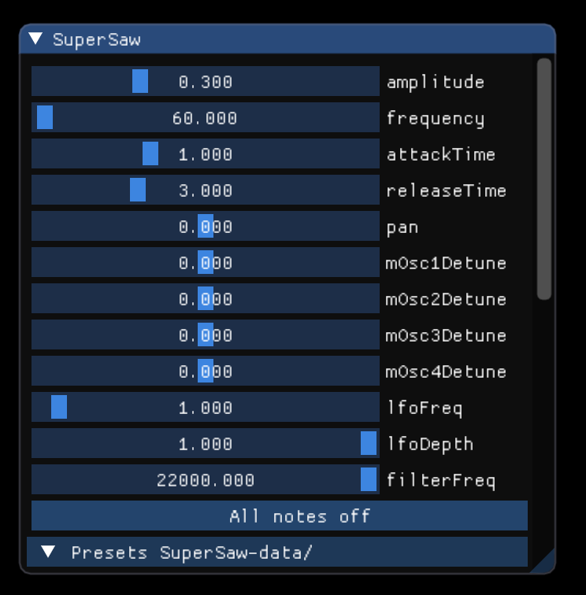

# Super Saw Synthesizer
This is an Allolib Playground application that implements a "Super Saw Synth" using tools from the Gamma synthesis library. It creates the "Super Saw" sound by including 4 saw oscillators that can be detuned from one another. This makes each oscillator's phase slightly different from one another, which results in a nice, rich sound. It also includes a low-pass filter and an LFO that can modulate parameters. Currently, the LFO is set up to modulate the amplitude and low-pass filter frequency cutoff to get a "pumping" Super Saw synth that is heard a lot in popular EDM songs. In this application, you are also able to translate your keyboard notes down an octave by pressing the "a" key and also up and octave by pressing the "f" key.

This application should serve as an example for implementing a super saw sound, a filter from Gamma, and an LFO that can be used to modulate parameters. In this README, I will explain the usage of the synthesizer, as well as how it was implemented.

## Usage
First, copy the `SuperSawEnv.cpp` file into `allolib_playground/tutorials/synthesis`. You can then `cd` into  `allolib_playground` run the file like so: `./run.sh /tutorials/synthesis/SuperSawEnv.cpp`.




**Parameters** 

`mOsc1Detune`: Amount of detuning in Hz for oscillator 1 (Similar for the rest of the oscillators)

`lfoFreq`: Frequency of the LFO curve in Hz. For example, a value of `1.0` makes the curve go through one cycle per second. 

`lfoDepth`: Depth of the LFO curve. This controls the minimum value that your modulated parameter will go to. For example, if the depth is set to `0.5`, the parameter you are modulating will go down to half of it's set value.

`filterFreq`: Cutoff frequency for the low-pass filter.

**LFO Run-Down**

An LFO is a Low-frequency oscillator. It is essentially used to modulate different musical parameters to create pulsing effects such such as tremolo and vibrato. It works by mapping the values on the LFO curve to the parameter you want to modulate, so the paramter will modulate automatically according to the LFO values. In this synth, the LFO curve is set to a Cosine function that is translated and transformed so the range of values is between 1 and the `lfoDepth` that the user set. In this synth, the LFO is mapped to modulate the `amplitude` and `filterFreq` parameters.

**Additional Feature: Octave Switching**

To go down an octave on your keyboard, simply press the `a` button your keyboard. To go up an octave, simply press the `f` button on your keyboard.

## Explanation of the code
**Detuning of Saw Oscillators**

We first start by including the Oscillator header file from Gamma, which allows use to use the Saw oscillator class.

`#include "Gamma/Oscillator.h"`


We then initialize multiple Saw oscillators like so

```
class SuperSaw : public SynthVoice
{
    public:
        // Unit generators
        gam::Pan<> mPan;
        gam::Saw<> mOsc;
        gam::Saw<> mOsc2;
        gam::Saw<> mOsc3;
        gam::Saw<> mOsc4;
        ...
```

We then create detune parameter sliders for the GUI in the `init()` method. This allows the user to set a detune value for each oscillator

```
void init() override
{
    ...
    createInternalTriggerParameter("mOsc1Detune", 0.0, -2.0, 2.0);
    createInternalTriggerParameter("mOsc2Detune", 0.0, -2.0, 2.0);
    createInternalTriggerParameter("mOsc3Detune", 0.0, -2.0, 2.0);
    createInternalTriggerParameter("mOsc4Detune", 0.0, -2.0, 2.0);
    ...
```

We can then take the detune values set by the user and set the frequency for each oscillator using the detune value as the offset for the frequency of the specified note.

```
void onProcess(AudioIOData &io) override
{
    ...
    mOsc.freq(getInternalParameterValue("frequency") + getInternalParameterValue("mOsc1Detune"));
    mOsc2.freq(getInternalParameterValue("frequency") + getInternalParameterValue("mOsc2Detune"));
    mOsc3.freq(getInternalParameterValue("frequency") + getInternalParameterValue("mOsc3Detune"));
    mOsc4.freq(getInternalParameterValue("frequency") + getInternalParameterValue("mOsc4Detune"));
    ...
```

**Setting up the filter**

First we have to include the Filter header file from Gamma

`#include "Gamma/Filter.h"`

Then we can initialize an AllPass Filter.

```
class SuperSaw : public SynthVoice
{
    public:
        ...
        // All Pass Filter
        gam::AllPass1<> allPass1;
        ...
```

Then we create a filter frequency parameter slider that the user can set

```
void init() override
{   
    ...
    createInternalTriggerParameter("filterFreq", 22000.0, 0.0, 22000.0);
    ...
```

Then we set the filter frequency using the user's desired frequency in the `onProcess()` method

```
allPass1.freq(getInternalParameterValue("filterFreq"));
```

In the `while(io())` loop, before outputting the sample, we pass our signal(s) through our filter's low pass function. This will only output the frequencies that are below the cutoff frequency that we set.

```
// Before we output our sample values, we feed them through our low-pass filter
io.out(0) += allPass1.low(s1);
io.out(1) += allPass1.low(s2);
```

**Setting up the LFO**

First we initialize an LFO oscillator

```
class SuperSaw : public SynthVoice
{
    public:
        ...
        // LFO (Low Frequency Oscillator)
        gam::LFO<> lfo;
        ...
```

Then we create modifiable GUI parameters for the LFO's frequency and depth

```
void init() override
{
    ...
    createInternalTriggerParameter("lfoFreq", 1, 0.0, 20);
    createInternalTriggerParameter("lfoDepth", 1, 0.01, 1);
    ...
```

Then we can set the frequency of the LFO in the `onProcess()` method

```
// Set frequency of LFO using desired frequency from user
lfo.freq(getInternalParameterValue("lfoFreq"));
```

Then we need to get the value of our LFO at every sample. Getting our LFO value from the depth and curve we chose is slightly more complicated. We need to translate and transform the function so its range is between [1,depth]. We do this in the `while(io())` loop since we need to calculate the LFO value for each sample.

```
float depth = getInternalParameterValue("lfoDepth");
// Calculate LFO value after getting desired depth from user
float lfoVal = ((lfo.cos() + 1.0) / (2 / depth)) + (1 - depth);
```

**Modulating parameters with the LFO**

Now that we have our `lfoVal`, we can multiply this by the parameters we want to modulate in our `while(io())` loop. Remember that the loop runs for each sample, so the LFO value will be different for each sample, which will allow the parameter to modulate according to the curve we set for each sample.

To modify the amplitude, we just multiply our signal by the `lfoVal`

`float s1 = (mOsc() + mOsc2() + mOsc3() + mOsc4()) * mAmpEnv() * getInternalParameterValue("amplitude") * lfoVal;`

To modify the frequency of our filter, we just have to multiply the cutoff frequency by the `lfoVal`

`allPass1.freq(getInternalParameterValue("filterFreq") * lfoVal);`

These two lines will map the LFO's translated/transformed cosine curve to the amplitude and filter cutoff frequency parameters, which modulates these parameters accordingly.

**Mapping keyboard keys to change octave**

First we declare an instance variable which will represent which octave we are on.

```
// We make an app.
class MyApp : public App
{
  float octaveOffset = 0;
  ...
```

Then we define a getter and a setter for our variable.
```
void setOctaveOffset(float num)
{
    this->octaveOffset = this->octaveOffset + num;
}
float getOctaveOffset()
{
    return this->octaveOffset;
}
```

Then, when the `a` key is pressed, we subtract 12 from the octave offset. And when the `f` key is pressed, we add 12 to the octave offset.

```
if (k.key() == 97)
{
    this->setOctaveOffset(-12);
}
if (k.key() == 102)
{
    this->setOctaveOffset(12);
}
```

Then, when we are setting the frequency of our synth based on what key we pressed, we add on the octave offset. This essentially offsets the midiNote by our octave offset, so we are only changing the midi note essentially. The calculation of the frequency using the midi note stays the same.

```
synthManager.voice()->setInternalParameterValue(
        "frequency", ::pow(2.f, (midiNote - 69.f + this->getOctaveOffset()) / 12.f) * 432.f);
```

